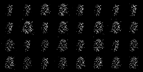
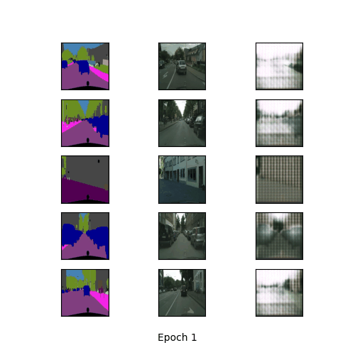

# Generative Adversarial Networks(GANs)

[](https://www.python.org/) [](https://pytorch.org/) [](#References)

This repo includes implementation of different types of GANs

## Results

**Vanilla GAN**




**Pix2Pix**



## References

<a id="1" href="https://arxiv.org/abs/1406.2661">[1] Generative Adversarial Nets</a>
```bibtex
@article{goodfellow2014generative,
  title={Generative adversarial networks},
  author={Goodfellow, Ian J and Pouget-Abadie, Jean and Mirza, Mehdi and Xu, Bing and Warde-Farley, David and Ozair, Sherjil and Courville, Aaron and Bengio, Yoshua},
  journal={arXiv preprint arXiv:1406.2661},
  year={2014}
}
```

<a id="2" href="https://phillipi.github.io/pix2pix/">[2] Image-to-Image Translation with Conditional Adversarial Nets</a>
```bibtex
@article{pix2pix2017,
  title={Image-to-Image Translation with Conditional Adversarial Networks},
  author={Isola, Phillip and Zhu, Jun-Yan and Zhou, Tinghui and Efros, Alexei A},
  journal={CVPR},
  year={2017}
}
```

<a id="3" href="https://junyanz.github.io/CycleGAN/">[3] Unpaired Image-to-Image Translation using Cycle-Consistent Adversarial Networks</a>
```bibtex
@inproceedings{CycleGAN2017,
  title={Unpaired Image-to-Image Translation using Cycle-Consistent Adversarial Networks},
  author={Zhu, Jun-Yan and Park, Taesung and Isola, Phillip and Efros, Alexei A},
  booktitle={Computer Vision (ICCV), 2017 IEEE International Conference on},
  year={2017}
}
```
